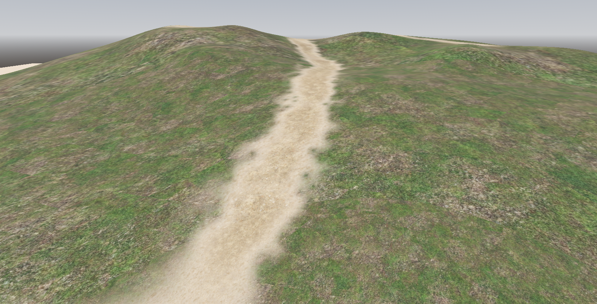
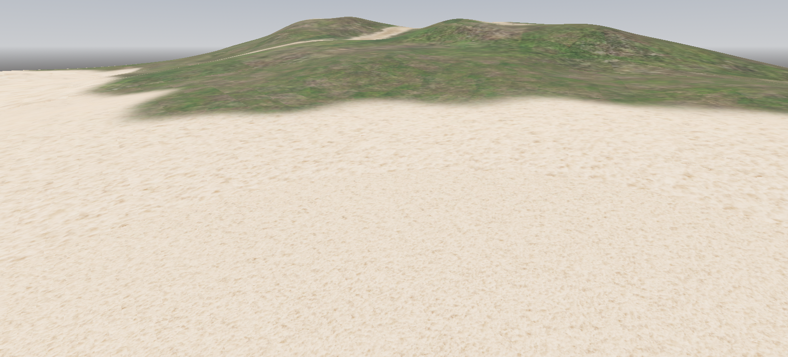

# Stochastic Tiling Splat-mapped Terrain with LOD

#### There are a few problems this shader aims to fix:

- Creating tiling textures is annoying and difficult to get right.
- High-detail textures viewed a large distances turn into a mushy mess.
- Getting all of the above to all work together with decent performance (minimal texture samples).

This shader is an all-in-one terrain shader that implements the following:

- A stochastic hexagonal texture tiler.
- A camera UV distance scaler.
- A basic splat-map terrain solution.

## Examples

### [Link to Shader](https://github.com/wmboeckman/godot-toolbox/blob/main/godot-4.x/gdshaders/stochastic-splatmapped-lod-terrain.gdshader)

## Credits

This script is a combination of other's work with minimal tweaks made for performance and cohesion.

- [nodding_sloth, Mikkelsen](https://godotshaders.com/shader/stochastic-hex-tiling-mikkelsens-adaptation/) : Stochastic Hex-Tiling (Mikkelsen’s Adaptation)
- [Qtan1](https://godotshaders.com/shader/camera-distance-uv-scaling/) : Camera Distance UV Scaling
- [Nanotech Gamedev](https://godotshaders.com/shader/albedo-terrain-mix-shader/) : Albedo Terrain Mix Shader